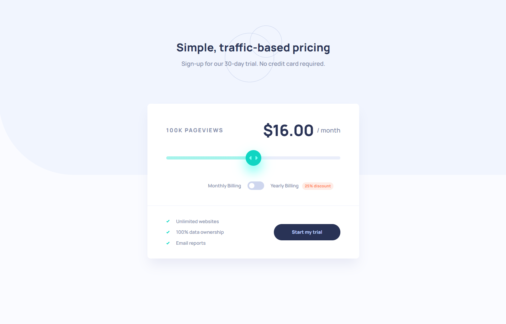
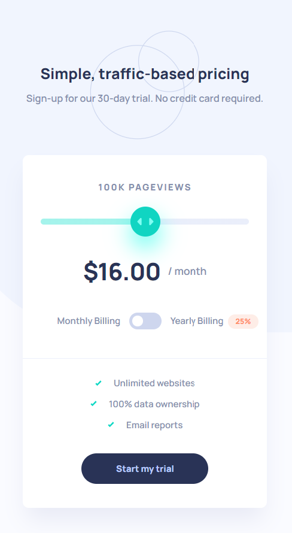

# Frontend Mentor - Interactive pricing component solution

This is a solution to the [Interactive pricing component challenge on Frontend Mentor](https://www.frontendmentor.io/challenges/interactive-pricing-component-t0m8PIyY8). Frontend Mentor challenges help you improve your coding skills by building realistic projects.

### Links

- Solution URL: https://github.com/aaronrubinstein/interactive-pricing-component
- Live Site URL: https://aaronrubinstein.github.io/interactive-pricing-component/

### Screenshots

**Desktop**

**Mobile**

